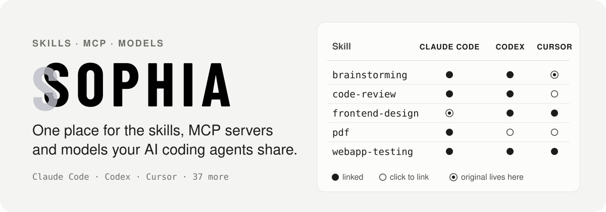
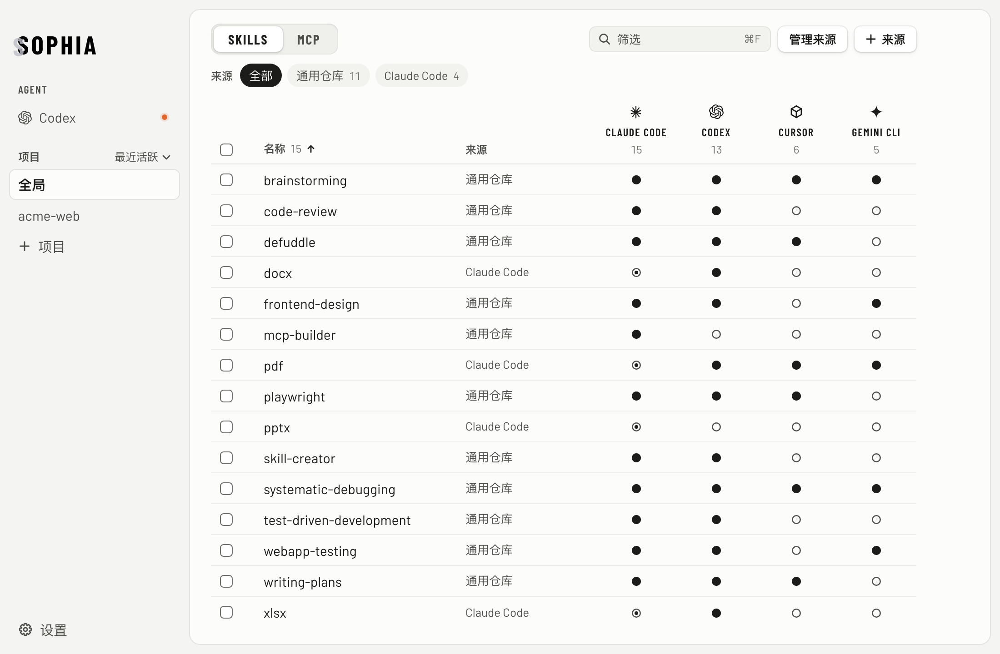
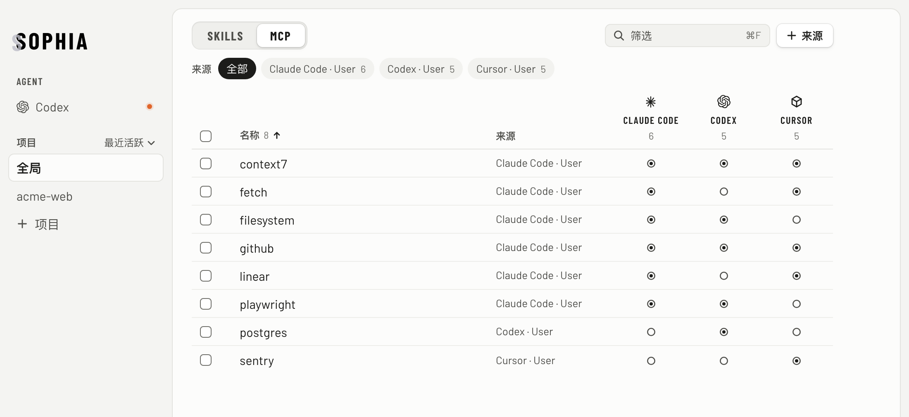
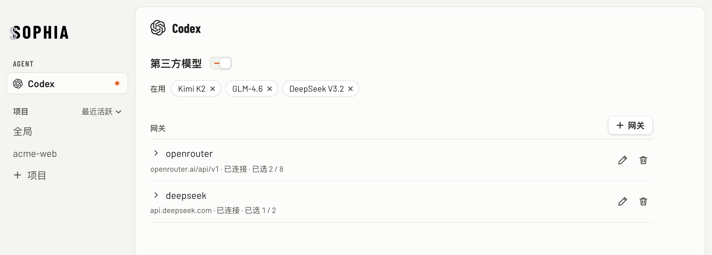

<p align="center">
  
</p>

You probably run more than one AI coding agent. Each keeps its own skills folder, its own MCP config file and its own model settings. Making one skill available to Claude Code *and* Codex means symlinking it twice by hand — and when a link breaks, nothing tells you.

Sophia puts it all in one table: **which skill or MCP server each agent can use right now**, and when something is in the way, **what it is**.

<p align="center">
  
</p>

## What it does

### Skills across every agent

- **Rows are skills, columns are agents.** ● the agent has it, ○ one click links it in, ⦿ the original lives in that agent's folder. Click a ● again to remove the link.
- **Skills come from sources** — a shared repo such as `~/.agents/skills`, an agent's own folder, a project, or an app that ships skills. Add a source once and all of its skills appear; switch on its rule and skills added to it later are linked automatically.
- **Global or per project.** Pick a location in the sidebar; each project gets its own table.
- **Knows the skill folders of 40 agents** — Claude Code, Codex, Cursor, Gemini CLI, GitHub Copilot, Windsurf and more — and only shows the ones you have installed.
- **Problems show up on the row they affect**: a broken link, two different skills with the same name, an agent folder that is itself a symlink. Each comes with the fix.

### MCP servers, copied between agents

The same table for MCP servers across **Claude Code, Codex and Cursor**, globally and per project. ⦿ means that agent's config defines the server; click ○ to copy the definition over. When the same name has different definitions, Sophia flags it and lets you pick which one to copy.

<p align="center">
  
</p>

### Third-party models in Codex (macOS)

Give Codex models from other providers. Sophia runs a small local gateway under `launchd` that translates between the Responses and Chat Completions APIs. Add several providers, choose the models Codex should see, and switch it on or off from the app or the menu bar. API keys go into the macOS Keychain — never into a file.

<p align="center">
  
</p>

## Safe by default

- **Links, not copies.** Adding a skill to an agent creates a symlink (a junction on Windows). Your skill folders are never rewritten.
- **Deleting an original asks first** and says which agents lose it. The folder is set aside so the delete can be undone, and moved to the Trash afterwards.
- **Config files are edited surgically.** Changes to `~/.claude.json`, `~/.codex/config.toml` and friends take a snapshot and a backup, replace the file atomically and check fingerprints before and after writing. Only the entry in question changes — comments, key order and line endings stay as they were. MCP changes can be undone.
- **Turning the Codex gateway off restores `config.toml` byte for byte.** It only ever adds or removes two top-level keys.

## Getting started

There is no prebuilt release yet, so build it from source. You need [Rust](https://rustup.rs) 1.98 or newer, Node.js 22, and the [Tauri prerequisites](https://tauri.app/start/prerequisites/) for your OS.

```bash
git clone https://github.com/zhengjiaqiao/sophia.git
cd sophia
npm ci
make build        # debug app in target/debug/bundle/
```

Use `make dev` for a development window with hot reload.

### Platform support

| | macOS | Windows | Linux |
|---|:-:|:-:|:-:|
| Skills | ✓ | ✓ | ✓ |
| MCP servers | ✓ | ✓ | ✓ |
| Codex third-party models, menu-bar panel | ✓ | – | – |

The interface is in Simplified Chinese for now.

## Development

| Path | What lives there |
|---|---|
| `crates/core` | All of the logic: discovery, scanning, planning actions, writing files safely. No async, no network, no Tauri. |
| `crates/gateway` | The Codex model gateway: local router, protocol translation, `launchd`, system proxy, Keychain. The only place with async and network code. |
| `src-tauri` | Tauri commands — each one is a thin call into `core`. |
| `src` | The React + TypeScript interface. |

```bash
make test         # run before every commit
```

`make test` runs the core and gateway tests, clippy, the UI lint, the type check and the front-end tests. Tests build real file trees in temporary directories instead of mocking the file system. Interface rules live in [`docs/DESIGN.md`](docs/DESIGN.md) (in Chinese); `scripts/lint-ui.mjs` turns the checkable ones into assertions that run with `make lint`.

## License

[MIT](LICENSE). The agent directory table and the linking strategy are adapted from [vercel-labs/skills](https://github.com/vercel-labs/skills) (MIT) — see [NOTICE](NOTICE).
