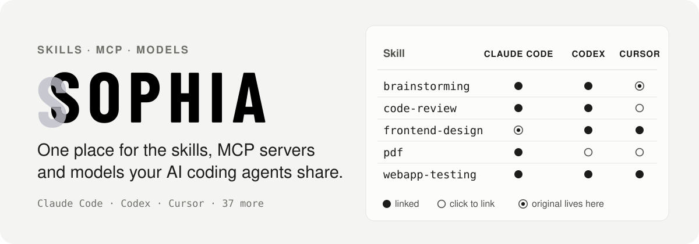
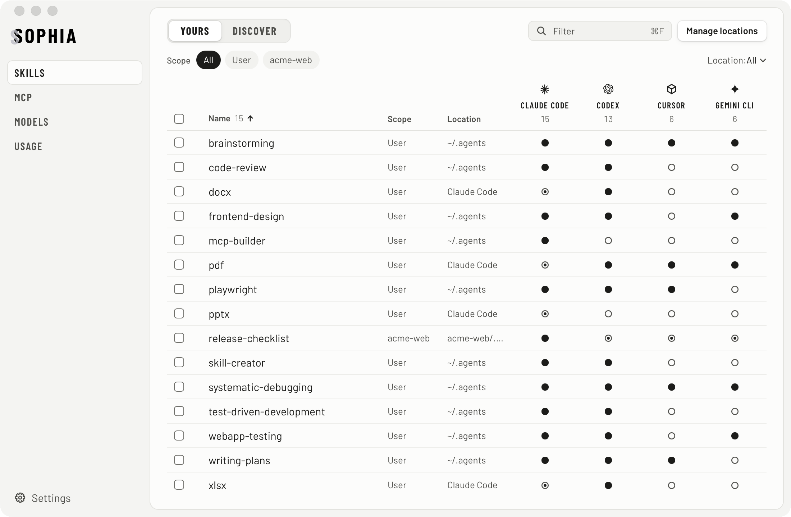
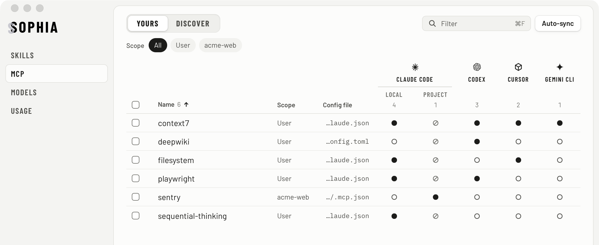
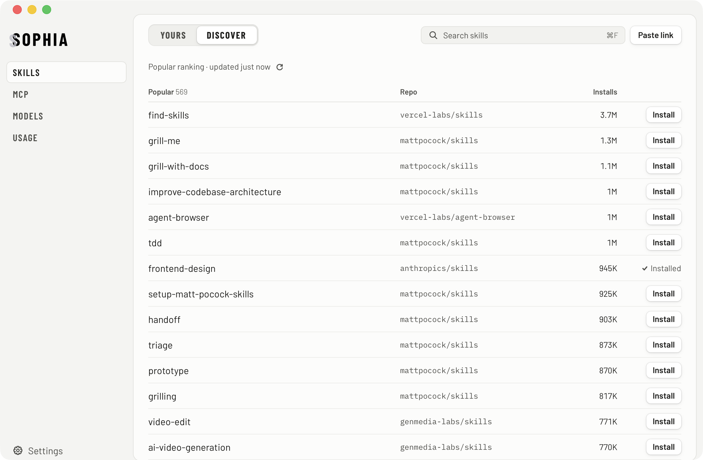
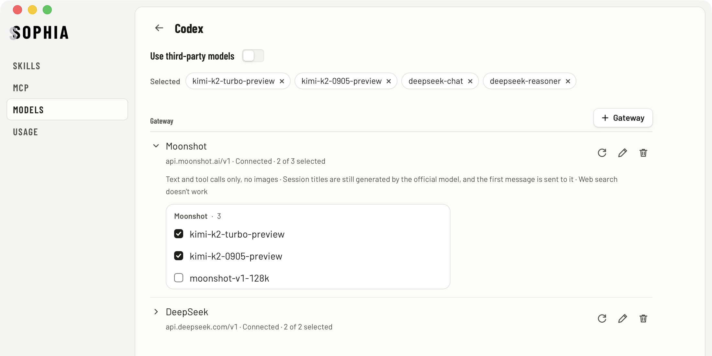

<p align="center">
  
</p>

<p align="center"><b>English</b> · <a href="./README.zh-CN.md">简体中文</a></p>

You probably run more than one AI coding agent. Each keeps its own skills folder, its own MCP config file and its own model settings. Making one skill available to Claude Code *and* Codex means symlinking it twice by hand — and when a link breaks, nothing tells you.

Sophia puts it all in one table: **which skill or MCP server each agent can use right now**, and when something is in the way, **what it is**.

<p align="center">
  
</p>

## What it does

### Skills across every agent

- **Rows are skills, columns are agents.** ● the agent has it, ○ one click links it in, ⦿ the original lives in that agent's folder. Click a ● again to remove the link.
- **Sophia reads what is already on disk.** Skills stay where they are — a shared folder such as `~/.agents/skills`, an agent's own folder, or a project. Nothing is imported or moved.
- **User-wide or per project.** Pick a scope and the table shows what is in effect there.
- **Knows the skill folders of 41 agents** — Claude Code, Codex, Cursor, Gemini CLI, GitHub Copilot, Windsurf and more — and only shows the ones you have installed.
- **Problems show up on the row they affect**: a broken link, two different skills with the same name, an agent folder that is itself a symlink. Each comes with the fix.

### MCP servers, copied between agents

The same table for MCP servers across **Claude Code, Codex, Cursor, Gemini CLI, GitHub Copilot CLI and Claude Desktop**, user-wide and per project. ● the server is configured for that agent, ○ one click copies the definition over. For Claude Code you can keep a server to yourself or share it with your team through `.mcp.json`. When the same name has different definitions, Sophia shows the difference and lets you pick which one to copy.

<p align="center">
  
</p>

### Discover new skills and MCP servers

Switch the Skills or MCP page from **Yours** to **Discover** to search popular skills on [skills.sh](https://skills.sh) and servers in the official MCP Registry. Install a skill by pasting a GitHub link to a repository or a folder, or add an MCP server by pasting the JSON from its README. Skills installed from GitHub can be updated in place: if you changed files locally, Sophia lists them and asks first, and an update can be undone.

<p align="center">
  
</p>

### Third-party models for Codex and Claude (macOS)

Use models from other providers in the Codex app and in Claude Desktop, next to the official ones. Sophia runs a small local gateway inside the app that translates between the APIs, so third-party models work while Sophia is open (turn on **Open at login** in Settings to keep them always available). Quitting Sophia asks first, then switches the Codex app and Claude Desktop back to the official models. Add several providers, choose the models each agent should see, and switch it on or off from the app or the menu bar. API keys are kept in a file in the Sophia data folder that only you can read (it is included in Time Machine backups).

<p align="center">
  
</p>

### Usage in the menu bar (macOS)

See how much of your Claude and Codex plan limits is left, right in the menu bar. Sophia asks Claude Code and Codex themselves; it never reads or refreshes your login tokens.

## Safe by default

- **Links, not copies.** Adding a skill to an agent creates a symlink (a junction on Windows). Linking never rewrites your skill folders.
- **Nothing is overwritten.** If an agent already has a different skill or MCP server with the same name, Sophia leaves it alone and tells you.
- **Deleting an original asks first** and says which agents lose it. The folder is set aside so the delete can be undone, and moved to the Trash afterwards.
- **Config files are edited surgically.** Changes to `~/.claude.json`, `~/.codex/config.toml` and friends take a snapshot and a backup, replace the file atomically and check fingerprints before and after writing. Only the entry in question changes — comments, key order and line endings stay as they were. MCP changes can be undone.
- **Turning the Codex gateway off restores `config.toml` byte for byte.** It only ever adds or removes two top-level keys.

## Getting started

There is no prebuilt release yet, so build it from source. You need [Rust](https://rustup.rs) 1.98 or newer, Node.js 22, and the [Tauri prerequisites](https://tauri.app/start/prerequisites/) for your OS.

```bash
git clone https://github.com/zhengjiaqiao/sophia.git
cd sophia
npm ci
make build        # debug app in target/debug/bundle/
```

Use `make dev` for a development window with hot reload.

### Platform support

macOS 14 (Sonoma) or later.

| | macOS | Windows | Linux |
|---|:-:|:-:|:-:|
| Skills, MCP servers, Discover | ✓ | untested | untested |
| Third-party models, menu-bar panel and usage | ✓ | – | – |

The interface is available in English, Simplified Chinese and Traditional Chinese, in light and dark appearance.

## Development

| Path | What lives there |
|---|---|
| `crates/core` | All of the logic: discovery, scanning, planning actions, writing files safely. No async, no network, no Tauri. |
| `crates/gateway` | The model gateway and usage probes: local router (runs inside the app process), protocol translation, system proxy, the API key file. The only crate with async and network code. |
| `src-tauri` | Tauri commands — each one is a thin call into `core` — plus the Discover network layer. |
| `src` | The React + TypeScript interface. |
| `locales` | Every interface string, in all three languages. |

```bash
make test         # run before every commit
```

`make test` runs the core and gateway tests, clippy, the UI lint, the type check and the front-end tests. Tests build real file trees in temporary directories instead of mocking the file system. `scripts/lint-ui.mjs` turns the interface rules into assertions that run with `make lint`.

## License

[MIT](LICENSE). The agent directory table and the linking strategy are adapted from [vercel-labs/skills](https://github.com/vercel-labs/skills) (MIT) — see [NOTICE](NOTICE).
