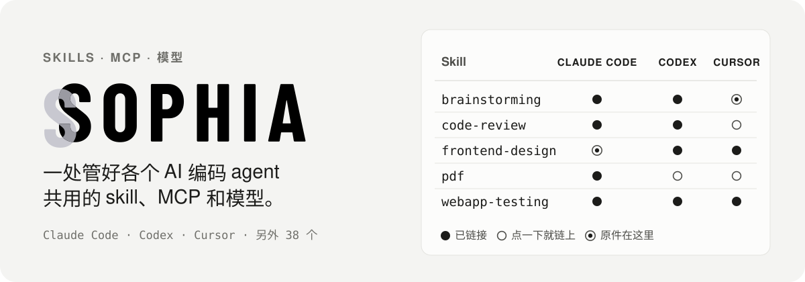
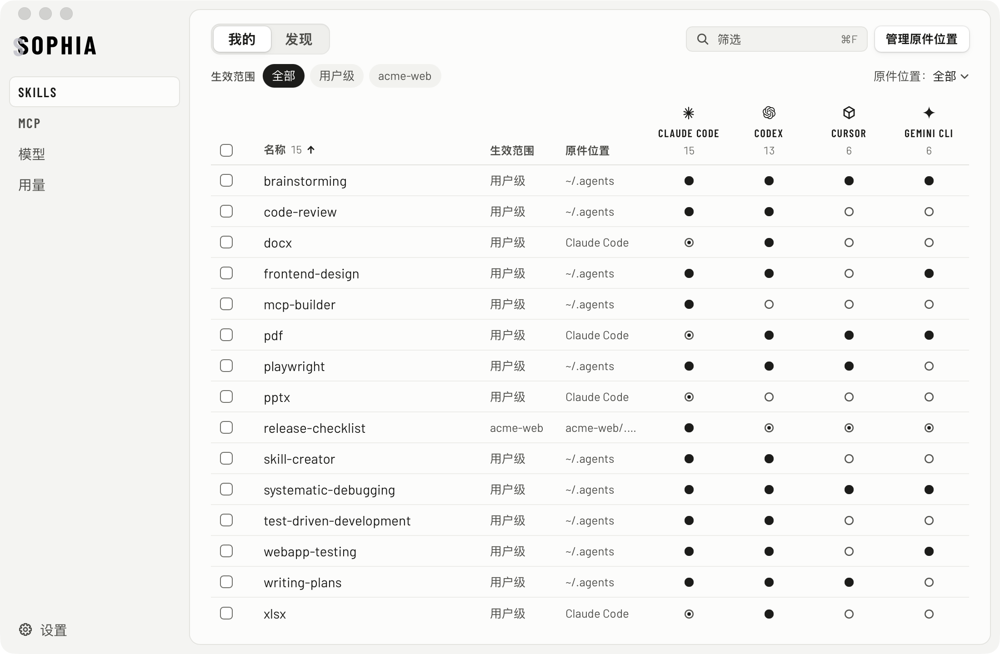
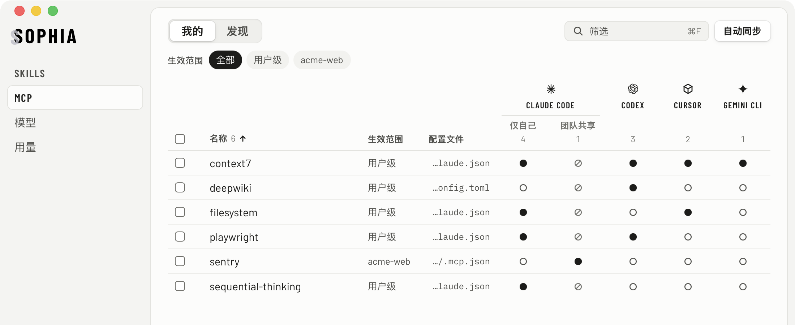
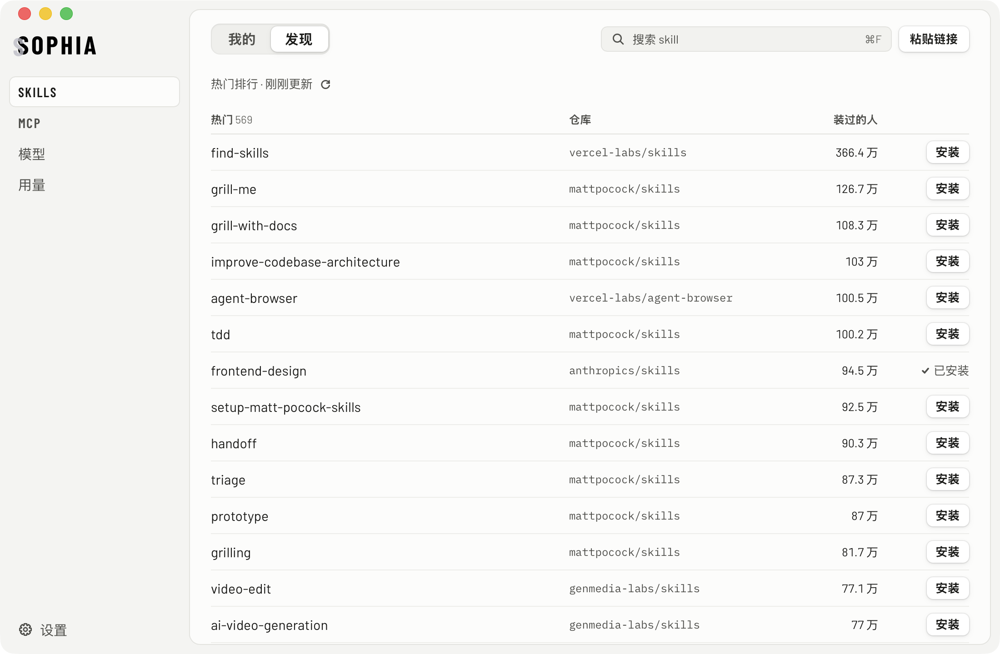
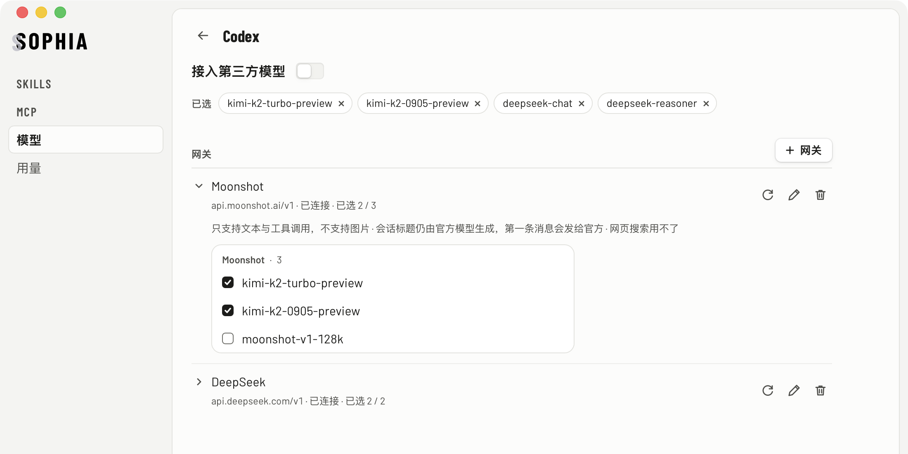

<p align="center">
  
</p>

<p align="center"><a href="./README.md">English</a> · <b>简体中文</b></p>

你多半不止用一个 AI 编码 agent。每个 agent 都有自己的 skills 文件夹、自己的 MCP 配置文件和自己的模型设置。想让 Claude Code 和 Codex 都能用上同一个 skill，就得手动建两次软链；链接断了，也没有任何提示。

Sophia 把这些放进一张表：**每个 agent 现在能用哪些 skill、哪些 MCP**；哪里没生效，**是什么挡住了**。

<p align="center">
  
</p>

## 能做什么

### 一个 skill，各个 agent 都能用

- **行是 skill，列是 agent。** ● 已经有了，○ 点一下就链上，⦿ 原件就在这个 agent 的文件夹里。再点一次 ● 就取消链接。
- **原件在哪就从哪管。** skill 留在原处：通用仓库 `~/.agents/skills`、某个 agent 自己的文件夹、某个项目，都行。不导入，也不搬动。
- **用户级或按项目。** 选一个生效范围，表格就显示在那里生效的内容。
- **认得 41 个 agent 的 skill 目录**：Claude Code、Codex、Cursor、Gemini CLI、GitHub Copilot、Windsurf 等，只显示你装了的。
- **问题就地显示在出问题的那一行**：失效的链接、同名的两份不同 skill、agent 的文件夹本身是个软链。每一种都指给你修复的位置。

### MCP 在 agent 之间复制

同样一张表管 MCP，覆盖 **Claude Code、Codex、Cursor、Gemini CLI、GitHub Copilot CLI 和 Claude 桌面应用**，用户级和项目级都行。● 表示这个 agent 已经配置了它，点 ○ 就把定义复制过去。Claude Code 的服务可以只给自己用，也可以通过 `.mcp.json` 和团队共享。同名但定义不同时，Sophia 列出差别，让你选复制哪一份。

<p align="center">
  
</p>

### 发现新的 skill 和 MCP

把 SKILLS 或 MCP 页从 **我的** 切到 **发现**，就能搜 [skills.sh](https://skills.sh) 上的热门 skill 和官方 MCP Registry 里的服务。贴一个 GitHub 仓库或文件夹的链接就能装 skill；把 MCP 说明文档里的 JSON 贴进来就能加 MCP。从 GitHub 装的 skill 可以原地更新：你在本地改过文件，Sophia 会列出来并先问你；更新也能撤销。

<p align="center">
  
</p>

### 给 Codex 和 Claude 用第三方模型（macOS）

在 Codex 应用和 Claude 桌面应用里，把其他服务商的模型和官方模型放在一起用。Sophia 在应用里跑一个本机小网关负责转换接口，Sophia 开着时第三方模型就能用（第一次打开时 Sophia 会默认开启「开机启动」，重启电脑后也随时能用，可以在设置里关）。退出 Sophia 前会先确认，再把 Codex 应用和 Claude 桌面应用改回官方模型。可以加多家服务商、为每个 agent 选要显示的模型，在应用或菜单栏里一键开关。API 密钥存在 Sophia 数据目录里的一个文件中，只有你的账户能读（以你身份运行的程序也读得到；会随 Time Machine 备份）。

<p align="center">
  
</p>

### 菜单栏看用量（macOS）

在菜单栏直接看 Claude 和 Codex 订阅额度还剩多少。用量由 Claude Code 和 Codex 自己去查。Sophia 只看你是否已登录，不保存、不上传你的登录令牌。

## 默认就安全

- **建链接，不复制。** 给 agent 加 skill 是建一条软链（Windows 上是 junction），不会改写你的 skill 文件夹。
- **不覆盖。** agent 里已经有同名但不同的 skill 或 MCP 时，Sophia 不动它，只告诉你。
- **使用统计和错误报告默认开着**，匿名，可以在设置「关于」里关掉。发什么见 [PRIVACY.md](./PRIVACY.md)。本机日志在 `~/Library/Logs/com.zhengjiaqiao.sophia/`。
- **卸载**：先退出 Sophia（会把 Codex 和 Claude 桌面应用改回官方模型），再删应用。Sophia 没在运行而 Codex 连不上时，把 `~/.codex/config.toml` 里标着「由 Sophia 写入」的那几行删掉即可。
- **删除原件先确认**，并说明哪些 agent 会失去它。原件先挪到一边、可以撤销，之后再移进废纸篓。
- **改配置文件只动那一项。** 改 `~/.claude.json`、`~/.codex/config.toml` 等文件之前先留快照和备份，原子替换，写前写后都核对指纹。只改相关的那一项，注释、键的顺序和换行符都原样保留。MCP 的改动可以撤销。
- **关掉 Codex 网关，`config.toml` 逐字节还原。** 它只增删两个根键。

## 开始使用

从 [GitHub Releases](https://github.com/zhengjiaqiao/sophia/releases/latest) 下载最新版。Apple 芯片的 Mac 选文件名带 `aarch64` 的 dmg，Intel 的选带 `x64` 的。已签名并通过 Apple 公证：打开 dmg，把 Sophia 拖进「应用程序」即可。需要 macOS 14（Sonoma）或更新。

也可以从源码构建。需要 [Rust](https://rustup.rs) 1.98 或更新版本、Node.js 22，以及你所用系统的 [Tauri 依赖](https://tauri.app/start/prerequisites/)。

```bash
git clone https://github.com/zhengjiaqiao/sophia.git
cd sophia
npm ci
make build        # 调试版应用在 target/debug/bundle/
```

用 `make dev` 打开支持热重载的开发窗口。

### 平台支持

macOS 14（Sonoma）或更新。

| | macOS | Windows | Linux |
|---|:-:|:-:|:-:|
| skill、MCP、发现 | ✓ | 未验证 | 未验证 |
| 第三方模型、菜单栏面板与用量 | ✓ | – | – |

界面支持简体中文、繁體中文和 English，浅色和深色外观。

## 开发

| 路径 | 内容 |
|---|---|
| `crates/core` | 全部业务逻辑：发现、扫描、生成操作计划、安全写文件。不含异步、网络和 Tauri。 |
| `crates/gateway` | 模型网关和用量探测：本机路由（在应用进程里运行）、协议转换、系统代理、密钥文件。唯一含异步和网络代码的 crate。 |
| `src-tauri` | Tauri 命令（每个只是薄薄一层，调用 `core`），以及「发现」的网络部分。 |
| `src` | React + TypeScript 界面。 |
| `locales` | 所有界面文案，三种语言。 |

```bash
make test         # 每次提交前都跑
```

`make test` 会跑 core 和 gateway 的测试、clippy、界面规范检查、类型检查和前端测试。测试在临时目录里搭真实的文件树，不模拟文件系统。`scripts/lint-ui.mjs` 把界面规范变成断言，随 `make lint` 运行。

## 许可证

[MIT](LICENSE)。agent 目录表和建链策略改编自 [vercel-labs/skills](https://github.com/vercel-labs/skills)（MIT），见 [NOTICE](NOTICE)。
